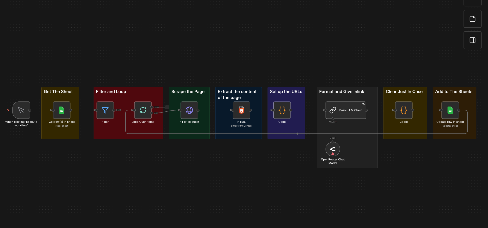

# 🔗 Semantic Internal Linking Automation Agent

   

An automated SEO agent built with **n8n** that analyzes content clusters (topic silos) and intelligently injects semantic internal links. Unlike basic plugins that just look for exact keyword matches, this workflow uses an LLM to understand the context of the page and dynamically decides whether to hyperlink an existing phrase or generate a new, contextually relevant bridge sentence.

## 🚀 The Problem
Internal linking is crucial for SEO (crawling efficiency and authority distribution), but managing it manually for hundreds of pages is:
1.  **Time-consuming:** Requires reading both source and target pages to find relevant spots.
2.  **Inconsistent:** Hard to maintain a perfect silo structure manually across large sites.
3.  **Low Quality:** Plugins often force links into unnatural keywords, hurting UX.

## 💡 The Solution
This workflow acts as an AI SEO Editor. It takes a list of URLs from a specific content cluster in a Google Sheet, scrapes their live content, and uses an LLM to cross-link them semantically.

### Key Features
* **Hybrid Injection Strategy:** The LLM decides the best linking method based on context:
    * *Method A (Anchor Match):* Finds an existing relevant phrase and wraps it in an `href`.
    * *Method B (Bridge Sentence):* If no relevant phrase exists, it writes a new, natural sentence containing the link and inserts it where it fits best.
* **Cluster-Based Logic:** Designed to work within specific topic clusters to ensure topical authority is preserved (e.g., only linking "Email Marketing" articles to other "Email Marketing" articles).
* **Live Content Analysis:** Scrapes the current live version of the page to ensure links are placed in the actual body content (`<article>`), ignoring navbars or footers.
* **CMS-Ready Output:** Writes the final, clean HTML output back to Google Sheets, ready to be copy-pasted directly into WordPress or any CMS.

## 🛠️ Technical Architecture

The workflow consists of **4 main stages**:

### 1. Ingestion & Filtering
* **Source:** Google Sheets (acts as the Content Plan database).
* **Logic:** Filters for rows that haven't been processed yet (`Status != Done`) to optimize API token usage.
* **Cluster Matching:** A Javascript Code node identifies the Topic of the current row and filters the dataset to find only relevant target URLs within the same cluster.

### 2. Scraping & Parsing
* **HTTP Request:** Fetches the raw HTML of the target URL.
* **HTML Extraction:** Cleans the DOM to isolate the main article body, removing scripts, styles, and boilerplate code to reduce noise for the LLM.

### 3. Semantic Processing
* **Engine:** OpenRouter (DeepSeek / GPT-4 via LangChain).
* **Prompt Engineering:** The model is instructed to act as a Ghostwriter. It is strictly forbidden from hallucinating information and must maintain the original tone of the article.
* **Sanitization:** A robust Regex cleaning step ensures the output contains only valid HTML tags (`
`, `<h2>`, `<a>`, `<ul>`), stripping out any metadata or markdown artifacts.

### 4. Formatting & Update
* **HTML Normalization:** Converts Markdown headers (##) to HTML tags (H2), fixes title casing, and ensures proper paragraph spacing.
* **Data Sync:** Updates the specific row in Google Sheets with the Optimized Content.

## ⚙️ How to Use

1.  **Import:** Download the `workflow.json` file from this repository and import it into your self-hosted n8n instance.
2.  **Setup Google Sheets:**
    * Create a sheet with columns: `URL`, `Topic`, `Current Content` (optional), `Result`, `Status`.
3.  **Configure Credentials:**
    * Connect your Google Sheets OAuth2 credential.
    * Connect your OpenRouter API key (or OpenAI/Anthropic).
4.  **Run:** Execute the workflow. It will process the cluster and populate the sheet with linked HTML.

## 📝 Example Output

**Input (Raw Text):**
> "Marketing automation is essential for growing businesses. It helps you save time."

**LLM Decision:** *Needs a link to the 'Email Marketing Guide'. No direct keyword found.*

**Output (Bridge Sentence Injection):**
> "Marketing automation is essential for growing businesses. **For example, using [strategies from our Email Marketing Guide](https://example.com/email-guide) can significantly boost retention.** It helps you save time."

---

### ⚠️ Prerequisites
* Self-hosted n8n or n8n Cloud.
* A valid API Key for an LLM provider.
* Google Cloud Console project with Sheets API enabled.
